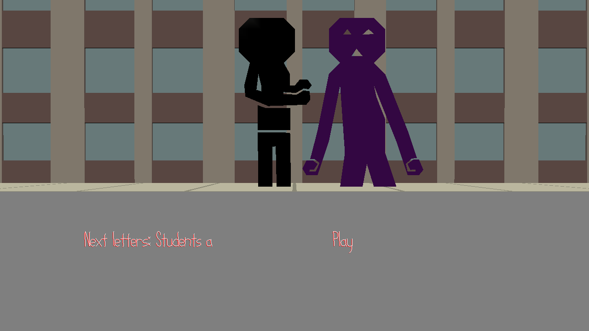

# Beat Boxer

Author: Siheng Li

Design: Oh no, a purple trash monster is invading your city,
use your melodic skills to give him a beat down... on the beat.
Plays just like Guitar Hero with a mouse & keyboard, but also
with type racer elements thrown in.

Screen Shot:

How To Play:
Type out the letters shown on the screen when the play text is shown.
If every note is hit properly, the full song will be revealed.

Sources: 
Whatever was in the base code
city.blend -- Jim McCann
BeepBox for the audio

This game was built with [NEST](NEST.md).

